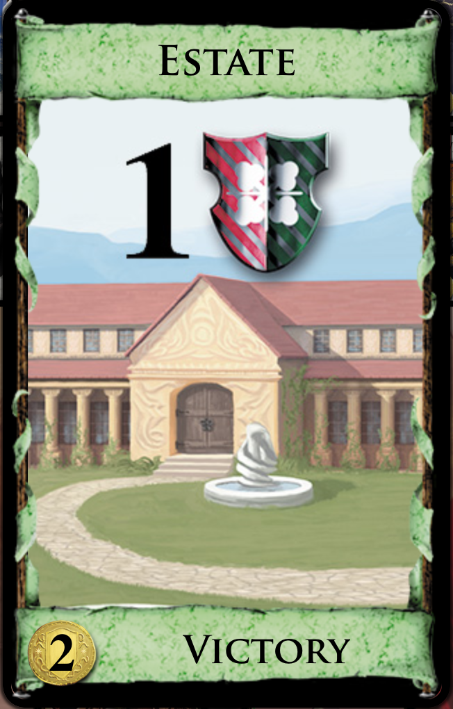
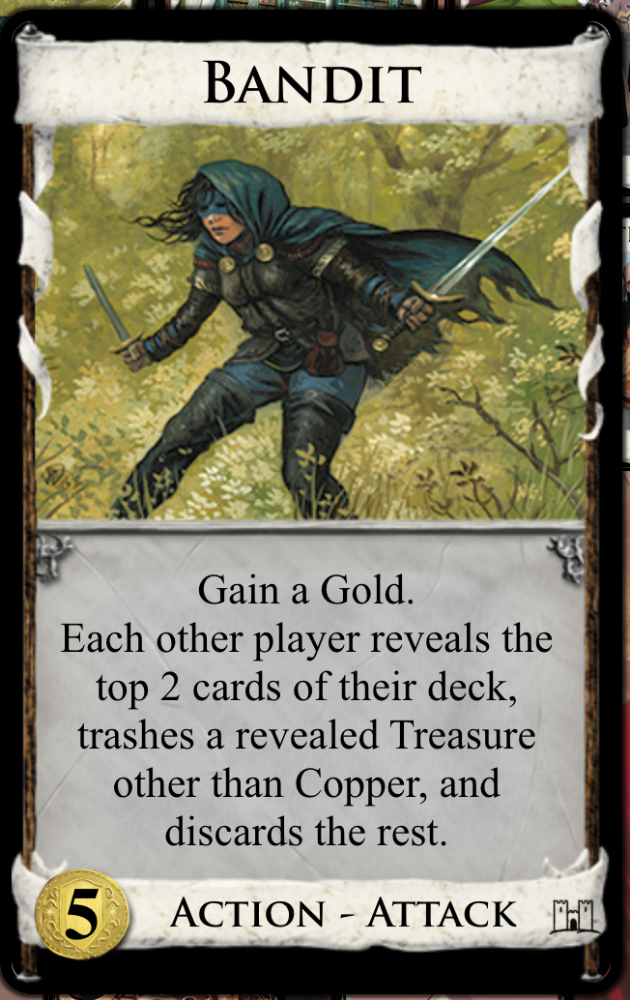

# Dominion

Dominion is a competitive turn-based deck-building card game. Each player starts
with 10 cards in their deck and acquires additional cards over the course of the
game to help them win. The game was originally released as a physical card game,
but an online version was added later (https://dominion.games/).

This guide is focused on providing a simple introduction, so it covers the Base 
set only and does not discuss game mechanics that are introduced in the expansion sets.

## Objective

To acquire the most victory points by the end of the game. Victory points are acquired via victory cards. 

## Game-ending conditions

The game ends when one of the following conditions is met:

* Three of the card supply piles are empty.
* The Province pile is empty.

## Card Types

There are several card types in the game, and some cards have multiple types.
The type will be labeled at the bottom of the card. Here are the basic types you
will see in the Base set:

### Treasure

A Treasure card gives you coins that you can use to buy cards during your turn.
Each Treasure card has a *cost* and a *value*. The cost is how many coins you
need to spend to buy the card. The value is how many coins you get when you play
the card. For example, a Gold costs 6 coins and is worth 3 coins. So you need 6
coins to buy it, and when you play it, it gives you 3 coins to use that turn.

#### Gold

A Gold costs 6 coins and is worth 3 coins.

#### Silver

A Silver costs 3 coins and is worth 2 coins.

#### Copper

A Copper costs 0 coins and is worth 1 coin.

### Victory

A victory card will either grant a fixed number of victory points or a variable number of
victory points based on the rule desribed on the card. Provinces, Duchies, and
Estates all grant a fixed number of victory points.

<table>
  <thead>
    <tr>
      <td></td>
      <td>Province</td>
      <td>Duchy</td>
      <td>Estate</td>
      <td>Curse</td>
    </tr>
  </thead>
  <tbody>
    <tr>
      <td></td>
      <td></td>
      <td></td>
      <td></td>
      <td></td>
    </tr>
    <tr>
      <td>Cost</td>
      <td>8</td>
      <td>5</td>
      <td>2</td>
      <td>0</td>
    </tr>
    <tr>
      <td>Victory points</td>
      <td>6</td>
      <td>3</td>
      <td>1</td>
      <td>-1</td>
    </tr>
  </tbody>
</table>

### Alternative victory cards
There are also "alternative" victory cards that give you different ways of
obtaining victory points. For example, the Gardens card is worth 1 point for
every 10 cards in your deck (rounded down), so if your deck has 49 cards, it is
worth 4 victory points.

### Action

Action cards allow you to enhance your turns, by giving you additional cards,
actions, buys, coins, and more.

Examples:

Smithy has an Action type only.

Bandit is an Action card that also has an Attack type. The Attack type just
means that its effect attacks other players.

## Setup

The board always includes piles of Provinces, Duchies, Estates, Curses, Golds,
Silvers, and Coppers, as well as 10 randomly selected Kingdom cards. Some
Kingdom cards require additional card piles for setup.

There is a Trash pile that is shared for all players. Cards in the Trash pile
are not part of any player's deck. (i.e. They can't be drawn) There are cards
that allow you to put cards in the Trash or take cards out of the Trash.

Each player starts with a deck of 10 cards, typically 7 Coppers and 3 Estates.
Some expansions include cards that change the setup by substituting Coppers or
Estates for other cards.

Each player shuffles their deck and draws 5 cards for their starting hand.

Each player also has a Discard pile. During the Cleanup phase of a player's
turn, all of the cards in play and in their hand are put into the Discard
pile. When the player runs out of cards to draw from their deck, the Discard
pile is shuffled and becomes the deck. (Essentially, cards are recycled. They
are drawn, played, discarded, shuffled, and drawn again.)

This is what the game board looks like in Dominion Online:

To see the details for each card, you can right-click on the card. To see
details for all of the Kingdom cards, you can select the "Kingdom" view in the
sidebar menu in the top right corner of the screen.

## Gameplay

A player is randomly chosen to go first. Each turn consists of the following phases:

### Action phase

During this phase, a player may play Action cards. By default, a player has one
"action" per turn, and each Action card takes one action to play. This implies
that they can only play one Action card. However, there are Action cards
that give you additional actions, such as Village. This allows you to play
more than one Action card in a single turn.

The text on Village says "+1 card +2 actions". This means that when you play
Village, you draw one card and gain two actions. The actions must be used that
turn.

### Buy

During this phase, a player may buy cards. You will need to play your treasure
cards to determine how many coins you have to spend. Note that some actions also
give coins that can be used during your Buy phase. These actions must be played
during the Action phase and cannot be played during the Buy phase (unless the
text on the card says otherwise.)

By default, a player has one "buy" per turn. It takes one buy to purchase a
card. As you might have guessed, there are Action cards that give you additional
buys, such as Festival.

In Dominion Online, at the start of the buy phase, you will see a button labeled
"Autoplay Treasures". Clicking this button will play all of the Treasure cards
in your hand. You can also individually click on each Treasure card to play it.
You must play all of the Treasure cards you want to use before you start buying
any cards. (e.g. If you have multiple buys in a turn, you can't play some
Treasures, buy a card, and then play more Treasures. All Treasures must be
played upfront.)

After playing your Treasure cards, you can select the card(s) you wish to buy by
clicking on the plus icon in the lower right corner of the card.

### Cleanup

During this phase, all of the cards that have been played, your remaining hand,
and any cards you bought go into your discard pile. There are some cards that
have effects which are triggered during the Cleanup phase. Draw five cards for
your next hand.

After the player has finished their turn, the next player takes a turn.
Note that some expansions add additional phases, such as the Night phase.

## Alternative references

* [How to play Dominion in 3 Minutes - The Rules Girl](https://www.youtube.com/watch?v=5jNGpgdMums)
* [How to play Dominion - Games Explained](https://www.youtube.com/watch?v=jB2XU573LxI)
* [Gameplay wiki article](http://wiki.dominionstrategy.com/index.php/Gameplay)
